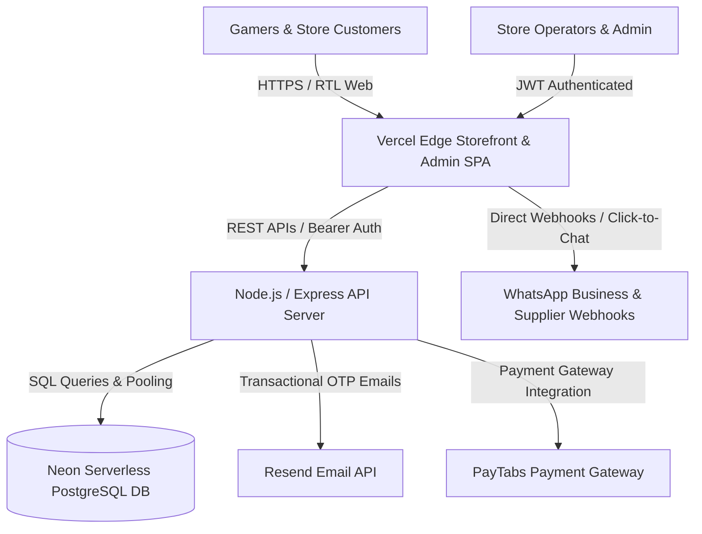
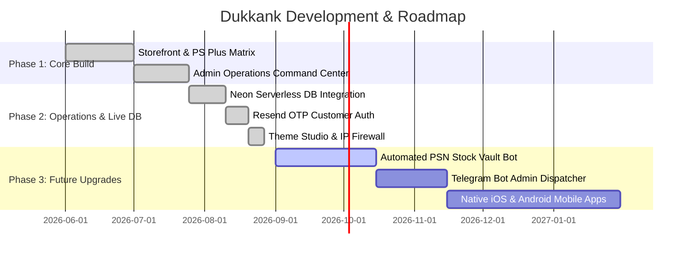

# Product Requirements Document (PRD)
## Project: Dukkank (دُكانك) — Next-Gen Gaming Storefront & Operations Management Platform
**Document Version:** 2.5 (Production Release)  
**Author:** Antigravity AI Engineering Team  
**Date:** August 2026  
**Status:** Live & Production Ready  

---

## 1. Executive Summary & Product Vision

### 1.1 Executive Summary
**Dukkank (دُكانك)** is a high-performance, digital-first e-commerce and store operations platform tailored specifically for the gaming industry in the MENA (Middle East & North Africa) region. The platform specializes in the sale and automated fulfillment of PlayStation Plus subscriptions (Essential, Extra, Deluxe), digital PlayStation game accounts, AAA launch pre-orders (GTA VI, EA SPORTS FC), and gaming gift codes.

Dukkank combines a consumer-facing storefront with a robust operations backend (**OrderDukkank**), offering instant OTP-based customer authentication, dynamic visual theming, real-time SEO injection, supplier management workflows, database-backed security firewalls, and comprehensive live audit logging.

### 1.2 Product Vision & Value Proposition
- **For Gamers:** An intuitive Arabic-first (RTL) shopping experience with instant price calculation, localized currency support, transparent golden warranty guarantees, and real-time order delivery tracking.
- **For Store Owners & Operators:** An all-in-one operations command center that eliminates manual spreadsheet tracking, bridges orders directly with external suppliers, manages inventory and pricing dynamically, and secures the entire storefront against cyber threats and DDoS attacks.

---

## 2. Technical Stack & Infrastructure Architecture



### 2.1 Technology Stack Details
| Layer | Technologies Used | Key Responsibilities |
| :--- | :--- | :--- |
| **Frontend Framework** | React 18, TypeScript, Vite, Tailwind CSS | High-speed SPA rendering, zero layout shift, modern responsive animations, RTL native styling. |
| **UI & Iconography** | Lucide React, Custom SVG Badges, Framer Motion transitions | Crisp pixel-perfect interface, accessible theme controls, interactive preview drawers. |
| **State & Context** | React Context (`DataContext`, `CartContext`, `AuthContext`, `CustomerContext`) | Centralized data synchronization, optimistic UI updates, offline-resilient local cache fallback. |
| **Backend Framework** | Node.js, Express.js (TypeScript) | High-throughput REST API server, security middlewares, IP firewalls, rate limiting. |
| **Database** | Neon Serverless PostgreSQL | Relational persistence for orders, inventory, customers, security logs, suppliers, site config. |
| **Authentication** | Custom HMAC JWT Tokens & Resend OTP Engine | Secure passwordless customer verification, salted SHA-256 admin authentication, master PIN protection. |
| **Deployment & Hosting** | Vercel Edge Global CDN | Global sub-50ms latency, automatic CI/CD deployment from GitHub `main` branch. |

---

## 3. User Personas & Target Audience

### Persona A: The Competitive Gamer (Tariq, 24)
- **Goal:** Wants to renew PlayStation Plus Deluxe or buy a pre-order game at a competitive price with instant delivery.
- **Pain Points:** Fear of getting scammed, complicated account transfer steps, non-responsive customer service.
- **Platform Solution:** Golden warranty badge (`الضمان الذهبي`), transparent account activation guide, instant WhatsApp fulfillment notifications.

### Persona B: The Store Super-Admin / Operator (Omar, 29)
- **Goal:** Complete end-to-end control over orders, supplier costs, profit margins, marketing banners, and visual design without touching raw code.
- **Pain Points:** High order volumes getting mixed up, manual copy-pasting of account credentials, cyber attacks and scraper bots.
- **Platform Solution:** Dedicated OrderDukkank workflow pipeline, 1-click supplier forwarding, automated database backups, and IP security firewall.

### Persona C: The Digital Key Supplier (Ahmed, 32)
- **Goal:** Receive structured order requests from Dukkank with game name, platform, and required region, then provide login credentials quickly.
- **Platform Solution:** Standardized WhatsApp dispatch templates with automatic order reference IDs.

---

## 4. Detailed Functional Specifications & Modules

### 4.1 Module 1: Storefront Experience & Consumer Flow
- **Interactive Hero & Social Proof:**
  - Dynamic announcement bar with customizable CTA buttons.
  - Live floating social proof toast notifications simulating recent purchases to boost conversion rates.
  - Quick WhatsApp chat widget with pre-filled inquiries.
- **PlayStation Plus Subscription Matrix:**
  - 3 Tier Selector: **Essential (الأساسي)**, **Extra (إضافي)**, and **Deluxe (فاخر)**.
  - Duration Switcher: 1 Month, 3 Months, 12 Months with live price recalculation and discount badges.
  - Feature comparison table highlighting multiplayer access, game catalog, Ubisoft+ classics, and cloud streaming.
- **Digital Games Showcase:**
  - Categorized grid with badges (Best Seller, Hot Offer, Exclusive, Pre-order).
  - Multi-platform filter: PS4, PS5, Dual-Gen, PC.
  - Search engine with instant filtering across game titles and descriptions.
- **AAA Launch Studios:**
  - Dedicated interactive launch studios for upcoming blockbuster titles (GTA VI, EA SPORTS FC 25).
  - Real-time countdown timer, pre-order reservation forms, and gameplay feature highlights.
- **Theme & Visual Presets Engine:**
  - 6 Built-in Cinematic Presets: `vice` (Neon Purple/Pink), `eafc` (Pitch Green), `gold` (Luxury Golden Black), `red` (PlayStation Red), `blue` (Classic PlayStation Deep Blue), and `cyber` (Cyan Futuristic).
  - Live Theme Studio allowing real-time CSS variable overrides for primary/secondary colors, background gradients, card radii, and fonts.
- **Smart Cart & Checkout Flow:**
  - Side slide-out Cart Drawer with item quantity counter and promo coupon input.
  - Payment Gateways: PayTabs online credit/debit card processing + Cash on Delivery / Direct Bank Transfer.
  - Post-purchase automated delivery modal with order summary and WhatsApp support routing.

---

### 4.2 Module 2: Customer Authentication & VIP CRM
- **Passwordless OTP Email Verification:**
  - Powered by Resend transactional email API with high inbox delivery rate.
  - 4-digit security code with a 10-minute expiry window.
  - Account recovery and password reset verification flow.
- **Customer Account Portal (`AllAccountPage.jsx`):**
  - **Orders Tab:** Full historical ledger of all placed orders, current fulfillment status, and account credentials.
  - **Digital Wallet (`المحفظة الرقمية`):** Cashback balance tracking, store credit top-up, and wallet-based checkouts.
  - **Warranty Center:** Active warranty timeline counter for purchased subscriptions and replacement claim forms.
  - **Profile Settings:** Name, verified email, international phone number formatting, and notification preferences.

---

### 4.3 Module 3: Admin Operations Command Center (**OrderDukkank**)
- **Order Pipeline & Workflow Engine:**
  ```mermaid
  stateDiagram-v2
      [*] --> NewOrder: Customer Checkout (Online/Cash)
      NewOrder --> SupplierSent: Forwarded to Supplier via WhatsApp
      SupplierSent --> AccountReceived: Account Credentials Stored & Cost Recorded
      AccountReceived --> Delivered: Credentials Sent to Customer
      Delivered --> Completed: Customer Verified & Warranty Active
      NewOrder --> Cancelled: Order Cancelled / Refunded
  ```
  - **New Orders (`طلب جديد`):** Auto-captured from checkout with transaction IDs, phone numbers, and payment status.
  - **Supplier Dispatch (`تحويل للمورد`):** 1-Click WhatsApp modal with pre-formatted supplier message template and cost tracking.
  - **Credential Storing (`استلام الحساب`):** Encrypted input field for PSN email, password, backup 2FA codes, and supplier cost.
  - **Customer Delivery (`تسليم العميل`):** Instant WhatsApp customer notification with clear login guidelines and safety rules.
  - **Delivered Accounts Archive:** Searchable vault of all fulfilled accounts for golden warranty claim lookups.
- **Supplier Directory (`إدارة الموردين`):**
  - Full CRUD management of game suppliers with phone numbers, payment notes, and active status toggles.
- **Catalog & Pricing Studio:**
  - Visual editors for Games, PS Plus Tiers, Bundles, and Gift Cards.
  - Batch price modifier, stock availability toggles, and image upload manager.
  - CSV Import & Export for bulk catalog updates.

---

### 4.4 Module 4: Visual CMS & Store Content Studio
- **Centralized Content Studio (`ContentTab.jsx`):**
  - Categorized editing tabs: Hero Banner, Games & Inventory, PS Plus Subscriptions, Activation Guide & Rules, Purchasing Steps, Official Store Policies, and Footer Navigation.
  - Real-time live preview sandbox rendering immediate changes without page reload.
  - Policy Master Editor: Direct editing of Privacy Policy, Terms & Conditions, Refund & Exchange Policy, and Golden Warranty Rules.

---

### 4.5 Module 5: Marketing & Growth Engine
- **Promo Coupon System:** Fixed amount or percentage discounts, minimum order constraints, usage limits, and expiration dates.
- **Flash Banner Management:** Top sticky banner with urgency countdown timer and custom link redirects.
- **Customer Acquisition & Affiliate Tracking:** Referral link generator, commission rates, and VIP tier loyalty rewards.

---

### 4.6 Module 6: Enterprise Security, System Performance & SEO
- **Dynamic SEO & Search Engine Infrastructure:**
  - Real-time dynamic `<title>`, Meta Description, Meta Keywords.
  - OpenGraph (OG) & Twitter Card tags updated dynamically on state change.
  - Schema.org Structured Data (`JSON-LD`) for `OnlineStore` and `Product` microdata.
  - Automated dynamic `/robots.txt` and `/sitemap.xml` HTTP endpoints.
- **Cyber Defense & Security Center (`SecurityTab.jsx`):**
  - **PostgreSQL-backed IP Blacklist:** Immediate `403 Forbidden` rejection at top-level Express middleware for blacklisted IPs.
  - **Global Rate Limiter:** Express `express-rate-limit` enforcing maximum 120 requests/minute per IP to prevent brute-force attacks.
  - **Anti-DDoS Shield:** Automated security headers (`X-Content-Type-Options: nosniff`, `Referrer-Policy`, strict anti-caching).
  - **Failed Logins Monitor:** Real-time log tracking suspicious administrator login attempts.
- **Store Maintenance & Anti-Theft Protection (`SiteSettingsTab.jsx`):**
  - **Maintenance Mode:** Fullscreen visitor lock with custom estimated return time and admin bypass.
  - **Content Shield:** Right-click prevention, text selection disabling, and CSS print/screenshot obfuscation.
- **System Performance & Cache Engine (`PerformanceTab.jsx`):**
  - Live server ping latency monitor (`performance.now()`).
  - LocalStorage quota visualizer (vs 5MB browser quota).
  - Granular cache item inspector with selective key deletion.
- **Database Backup & Disaster Recovery Center (`BackupTab.jsx`):**
  - 1-Click Complete System Export: Bundles all PostgreSQL database tables + LocalStorage into structured `.json`.
  - Selective exports: Products only, Orders only, System settings only, Marketing data only.
  - Live Database Restore: Ingests backup `.json` and syncs all database entities via backend API with zero data loss.
- **Audit Log Trail (`AuditTab.jsx`):**
  - Granular timestamped record of every administrative action (Creates, Updates, Deletes) with admin email and resource ID.
  - 1-Click CSV export for regulatory and internal management audits.

---

## 5. Relational Database Schema (PostgreSQL)

```sql
-- Store Configuration & Metadata
CREATE TABLE IF NOT EXISTS store_config (
    key VARCHAR(100) PRIMARY KEY,
    value JSONB NOT NULL,
    updated_at TIMESTAMPTZ DEFAULT NOW()
);

-- Administrator Credentials & Master Config
CREATE TABLE IF NOT EXISTS admin_config (
    key VARCHAR(100) PRIMARY KEY,
    value TEXT NOT NULL,
    updated_at TIMESTAMPTZ DEFAULT NOW()
);

-- Customer Profiles
CREATE TABLE IF NOT EXISTS customers (
    id VARCHAR(100) PRIMARY KEY,
    name TEXT,
    email TEXT UNIQUE NOT NULL,
    phone TEXT,
    password TEXT,
    email_verified BOOLEAN DEFAULT FALSE,
    wallet_balance NUMERIC(10, 2) DEFAULT 0.00,
    created_at TIMESTAMPTZ DEFAULT NOW()
);

-- Store Orders (OrderDukkank Core)
CREATE TABLE IF NOT EXISTS store_orders (
    id SERIAL PRIMARY KEY,
    order_number VARCHAR(50) UNIQUE NOT NULL,
    customer_name VARCHAR(200) NOT NULL,
    customer_phone VARCHAR(50),
    customer_email VARCHAR(200),
    product_type VARCHAR(50) NOT NULL,
    game_name VARCHAR(200),
    subscription_type VARCHAR(100),
    subscription_duration VARCHAR(50),
    platform VARCHAR(50),
    customer_paid NUMERIC(10, 2) NOT NULL,
    cost_price NUMERIC(10, 2),
    profit NUMERIC(10, 2),
    status VARCHAR(50) DEFAULT 'new',
    order_source VARCHAR(30) DEFAULT 'manual',
    paytabs_tran_ref VARCHAR(100),
    supplier_id INTEGER REFERENCES suppliers(id),
    supplier_forwarded_at TIMESTAMPTZ,
    account_credentials TEXT,
    account_received_at TIMESTAMPTZ,
    delivered_at TIMESTAMPTZ,
    completed_at TIMESTAMPTZ,
    items_json JSONB,
    created_at TIMESTAMPTZ DEFAULT NOW(),
    updated_at TIMESTAMPTZ DEFAULT NOW()
);

-- Suppliers Management
CREATE TABLE IF NOT EXISTS suppliers (
    id SERIAL PRIMARY KEY,
    name VARCHAR(200) NOT NULL,
    phone VARCHAR(50) NOT NULL,
    notes TEXT,
    is_active BOOLEAN DEFAULT TRUE,
    created_at TIMESTAMPTZ DEFAULT NOW()
);

-- IP Firewall Blacklist
CREATE TABLE IF NOT EXISTS security_ip_blocks (
    id VARCHAR(100) PRIMARY KEY,
    ip VARCHAR(100) NOT NULL UNIQUE,
    reason TEXT,
    created_at TIMESTAMPTZ DEFAULT NOW()
);

-- Audit Trail Log
CREATE TABLE IF NOT EXISTS store_audit_log (
    id SERIAL PRIMARY KEY,
    action VARCHAR(50) NOT NULL,
    target_type VARCHAR(50) NOT NULL,
    target_label TEXT,
    target_id VARCHAR(100),
    actor_email VARCHAR(200),
    timestamp TIMESTAMPTZ DEFAULT NOW()
);
```

---

## 6. Key REST API Endpoints

### 6.1 Authentication & User APIs
- `POST /api/auth/login` — Administrator authentication (Returns HMAC Bearer Token).
- `POST /api/auth/change-credentials` — Updates admin email, password, and invalidates older sessions.
- `POST /api/auth/register/send-otp` — Generates and emails 4-digit registration code via Resend.
- `POST /api/auth/register/verify-otp` — Validates OTP and persists customer account in database.
- `POST /api/auth/customer/login` — Authenticates verified customers.
- `POST /api/auth/forgot-password/send-otp` & `/reset` — Password recovery flow.

### 6.2 Catalog & CMS APIs
- `GET /api/store` — Public endpoint returning all store items, games, PS Plus tiers, sections, theme, and SEO settings.
- `PUT /api/admin/store` — Updates store general metadata.
- `PUT /api/admin/games/:id` & `PUT /api/admin/subscriptions/:id` — Granular catalog updating.
- `PUT /api/admin/theme` — Real-time visual CSS theme customization.
- `PUT /api/admin/content` — Visual CMS content updater.
- `PUT /api/admin/site-settings` — Maintenance mode and content shield settings.

### 6.3 OrderDukkank & Supplier APIs
- `GET /api/admin/orders` — Paginated order list with search, filter, and date ranges.
- `POST /api/store-orders` — Checkout order creation (supports single item and multi-item cart JSON).
- `PUT /api/admin/store-orders/:id/forward-supplier` — Sets status to `supplier_sent`, records cost price and supplier ID.
- `PUT /api/admin/store-orders/:id/receive-account` — Stores credentials and transitions to `account_received`.
- `PUT /api/admin/store-orders/:id/deliver` — Marks order as delivered to customer.
- `PUT /api/admin/store-orders/:id/complete` — Finalizes order and starts warranty clock.
- `GET /api/admin/suppliers` & `POST /api/admin/suppliers` — Full Supplier CRUD.

### 6.4 Security & System APIs
- `GET /api/admin/ip-blocks` — Lists all blocked IPs.
- `POST /api/admin/ip-blocks` — Adds new IP to firewall database table and in-memory rejection map.
- `DELETE /api/admin/ip-blocks/:idOrIp` — Removes IP block.
- `GET /robots.txt` & `GET /sitemap.xml` — Dynamic SEO crawler endpoints.

---

## 7. Non-Functional Requirements (NFR)

| Parameter | Specification | Validation Method |
| :--- | :--- | :--- |
| **Response Latency** | Edge Server Response Time < 60ms globally. | Real-time `performance.now()` health checks. |
| **Page Speed Score** | Google PageSpeed / Lighthouse > 90 on Mobile & Desktop. | Optimized bundle splitting and asset compression. |
| **Localization** | 100% Arabic Native UI with strict RTL layout flow. | Comprehensive RTL validation and font rendering. |
| **Uptime & SLA** | 99.9% High Availability powered by Vercel Edge + Neon DB. | Continuous health probes and auto-recovery. |
| **Security Standards** | Zero plaintext credentials; parameterized SQL queries. | SQL injection defense and OWASP compliance. |

---

## 8. Release Milestones & Future Product Roadmap



---
*End of Product Requirements Document (PRD) — Dukkank Platform*
